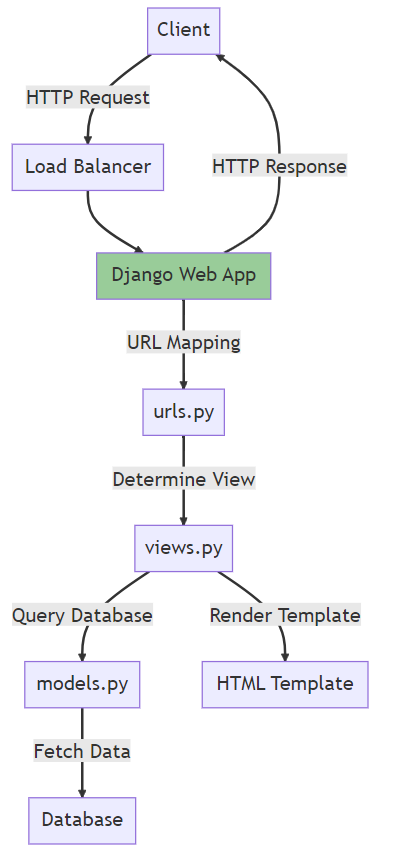

Nama    : Indira Arifia Rahmah

NPM     : 2206811846

Kelas   : PBP B

# Tugas 2
## POST vs. GET
Metode POST dan GET adalah metode _request_ yang paling umum digunakan dalam protokol HTTP untuk berkomunikasi dengan server. Keduanya digunakan untuk mengirimkan data dari klien ke server, namun cara dan tujuannya berbeda.
**GET**
1. Tujuan utama dari metode GET adalah untuk mengambil data dari server;
2. Data yang dikirim ke server ditambahkan atau muncul di URL dalam bentuk _query string_, contohnya: http://ruby.com/page?name=Hemnes&qty=3. Hal ini menyebabkan adanya batasan jumlah karakter yang bisa dimasukkan;
3. Informasi yang dikirimkan menjadi kurang aman karena bisa dilihat langsung pada URL sehingga cocok untuk mengirim data yang kurang sensitif;
4. GET lebih cocok untuk permintaan yang tidak mengubah status data di server, seperti mengambil halaman web atau mengambil data.
**POST**
1. Tujuan utama dari metode POST adalah untuk mengirimkan data ke server untuk diproses;
2. Data yang dikirim ke server masuk ke dalam _body request_ (tidak muncul di URL) sehingga tidak memiliki batas jumlah karakter;
3. Lebih aman sehingga cocok untuk mengirim data sensitif;
4. Cocok untuk mengirimkan data _form_, mengunggah file, atau melakukan operasi yang mengubah data di server.

## Perbedaan Antara JSON, XML, dan HTML dalam Konteks Pengiriman Data
Dilansir dari AWS Amazon, JSON (JavaScript Object Notation) dan XML (eXtensible Markup Language) adalah representasi data yang digunakan dalam pertukaran data antaraplikasi. JSON adalah format pertukaran data terbuka yang dapat dibaca baik oleh manusia maupun mesin. JSON bersifat independen dari setiap bahasa pemrograman dan merupakan _output_ API umum dalam berbagai aplikasi. XML adalah bahasa markah yang menyediakan aturan untuk menentukan data apa pun. XML menggunakan tanda untuk membedakan antara atribut data dan data aktual. Meskipun kedua format tersebut digunakan dalam pertukaran data, JSON lebih fleksibel dan populer digunakan. Sedangkan, HTML (Hypertext Markup Language) adalah bahasa markah yang digunakan untuk membuat halaman web. HTML digunakan untuk mengatur tampilan dan struktur halaman web.

**XML (Extensible Markup Language)**
- Tujuan: XML dirancang untuk menyimpan dan mengangkut data dan bahasa markup yang memungkinkan definisi tag secara kustom;
- Struktur: XML menggunakan tag (mirip dengan HTML) untuk mendefinisikan elemen data dan memiliki struktur yang hierarkis;
- Format: XML menyimpan data dalam struktur pohon dengan _namespace_ untuk kategori data yang berbeda;
- Keterbacaan: strukturnya lebih rumit daripada JSON;
- Metadata: XML memungkinkan penyertaan atribut dalam elemen, memungkinkan penyimpanan metadata tambahan;
- Dukungan: hampir semua bahasa pemrograman memiliki dukungan untuk _parsing_ dan menghasilkan XML.

**JSON (JavaScript Object Notation)**
- Tujuan: JSON adalah format ringan untuk pertukaran data antar klien dan server atau antara aplikasi;
- Struktur: JSON memiliki struktur objek dan array yang lebih sederhana/ringkas daripada XML;
- Format: JSON menggunakan struktur seperti __map__ dengan pasangan kunci-nilai;
- Keterbacaan: JSON lebih mudah dibaca dan ditulis oleh manusia dibandingkan dengan XML;
- Metadata: JSON tidak mendukung atribut dalam bentuk yang sama. Semua data, termasuk metadata, dinyatakan dalam pasangan kunci-nilai;
- Dukungan: karena kedekatannya dengan JavaScript, JSON sangat populer dalam aplikasi web modern dan memiliki dukungan luas di berbagai bahasa pemrograman.

**HTML (Hypertext Markup Language)**
- Tujuan: HTML adalah bahasa _markup_ yang digunakan untuk mendeskripsikan halaman web. Tujuan utamanya adalah presentasi konten, bukan penyimpanan atau transport data;
- Struktur: HTML menggunakan _tag_ untuk mendefinisikan elemen seperti paragraf, tautan, gambar, dll;
- Keterbacaan: HTML dapat dibaca oleh manusia tetapi fokusnya adalah pada presentasi, bukan struktur data;
- Metadata: HTML memiliki atribut untuk banyak elemennya, yang digunakan untuk mendefinisikan karakteristik tambahan (misalnya, atribut `src` untuk tag `img`);
- Dukungan: semua browser web dapat mem-_parse_ dan menampilkan halaman HTML.

# Tugas 1
Nama Aplikasi: Ruby (tautan adaptable.io: https://my-app-ruby.adaptable.app/)

Pengerjaan tugas ini adalah hasil pembelajaran dari tutorial yang telah diajarkan saat sesi lab di kuliah. Cara saya menuntaskan tugas ini adalah melalui pembuatan proyek lain sebagai latihan terlebih dulu sebelum mengerjakan proyek ini. Dengan demikian, saya memahami langkah demi langkahnya dengan membiasakan diri membuat suatu proyek.

Dalam bagan tersebut, berikut adalah penjelasannya:

1. Client mengirimkan HTTP Request ke Load Balancer.
2. Load Balancer meneruskan request tersebut ke Django Web App.
3. Django Web App menggunakan urls.py untuk pemetaan URL dan menentukan view mana yang harus dipanggil.
4. views.py dapat melakukan query ke database melalui models.py.
5. models.py bertugas untuk mengambil data dari Database.
6. views.py juga bertugas untuk merender template yang ada di HTML Template.
7. Setelah itu, Django Web App mengirimkan HTTP Response kembali ke Client.

Virtual Environment adalah alat yang membantu memisahkan dependensi yang diperlukan oleh berbagai proyek dengan membuat lingkungan virtual python terisolasi untuk proyek tersebut.
Jika kita menggunakan virtual environment dalam membuat web aplikasi, beberapa manfaat yang kita dapatkan, yaitu:
1. Dependensi yang terisolasi. Artinya setiap proyek dapat memiliki dependensi yang berbeda dengan versi yang berbeda. Hal ini berfungsi untuk menghindari konflik antar versi.
2. Keamanan. Jika ada suatu pustaka pada proyek kita yang rentan keamanannya maka risiko keamanan hanya dimiliki oleh pustaka itu saja, lingkungan lainnya tidak.
3. Virtual environment memungkinkan kita untuk menggunakan versi Python yang berbeda untuk proyek yang berbeda.
4. Memudahkan dalam berbagi proyek. Requirements.txt memudahkan kolaborasi antarpengembang karena dapat dengan muda mengintall semua dependensi yang diperlukan dalam virtual environment mereka sendiri.

Virtual environment penting dalam membuat proyek seperti web aplikasi ini. Akan tetapi, kita juga dapat membuat aplikasi web berbasis Django tanpa menggunakan virtual environment. Tentu saja hal ini diikuti oleh beberapa risiko, seperti (1) rentan akan konolik antardependensi; (2) Jika ingin memperbarui atau menghapus pustaka tertentu maka harus dengan cara manual; (3) 
Jika ada proyek yang rentan keamanannya, maka akan memengaruhi proyek lainnya juga.

Model-View-Controller (MVC), Model-View-Template (MVT), dan Model-View-ViewModel (MVVM) adalah pola desain yang digunakan dalam pengembangan perangkat lunak, khususnya aplikasi web dan aplikasi berbasis GUI. Berikut ini penjelasan singkat dan perbedaan dari ketiga pola desain tersebut:

Model-View-Controller (MVC)
Model: Bagian ini bertanggung jawab atas data dan aturan bisnis. Ini mewakili struktur data dan menyediakan mekanisme untuk membaca, menyimpan, dan memperbarui data.
View: Bagian ini menampilkan data untuk pengguna. Dalam aplikasi web, view biasanya adalah halaman HTML yang dihasilkan.
Controller: Menerima input dari pengguna melalui view, memprosesnya (dengan interaksi dengan model), dan mengembalikan tampilan output yang sesuai.
Aplikasi yang sering menggunakan pola ini: Rails, ASP.NET MVC, dan banyak framework web lainnya.

Model-View-Template (MVT)
Mirip dengan MVC, namun dengan sedikit perbedaan dalam pendekatan.
Model: Sama seperti di MVC.
View: Bertanggung jawab untuk memproses model dan mengembalikannya ke template. Dalam konteks Django (yang menggunakan MVT), "view" lebih seperti controller dalam MVC.
Template: Ini adalah bagian yang menggambarkan bagaimana data harus ditampilkan. Ini mirip dengan "view" dalam MVC.
Django adalah contoh framework yang menggunakan pola MVT. Meskipun sering disebut sebagai "MVC", Django sebenarnya lebih mendekati MVT.

Model-View-ViewModel (MVVM)
Sering digunakan dalam aplikasi berbasis GUI, seperti yang dibuat dengan WPF, Angular, atau Knockout.js.
Model: Sama seperti di MVC dan MVT.
View: Hanya bertanggung jawab untuk menampilkan UI. Tidak memiliki logika bisnis.
ViewModel: Bertindak sebagai penghubung antara Model dan View. ViewModel menyajikan data dari Model dalam format yang dapat dengan mudah ditampilkan oleh View, dan juga menerima perintah dari View.
MVVM memungkinkan pemisahan yang lebih baik antara logika bisnis dan tampilan UI, memudahkan pengujian, dan mendukung pemrograman reaktif.
Perbedaan Utama:

MVC: Pemisahan antara data (Model), tampilan (View), dan logika bisnis (Controller).
MVT: Sebuah varian dari MVC di mana "View" dalam MVT bertindak lebih seperti "Controller" dalam MVC, dan "Template" bertindak seperti "View" dalam MVC.
MVVM: Didesain untuk aplikasi berbasis GUI. ViewModel bertindak sebagai perantara antara Model dan View, memungkinkan pengikatan data dua arah dan pemisahan antara logika UI dan logika bisnis.
Meskipun ada perbedaan dalam struktur dan terminologi, tujuan utama dari semua pola desain ini adalah memisahkan tanggung jawab dalam aplikasi, sehingga memudahkan pemeliharaan, pengembangan, dan pengujian.