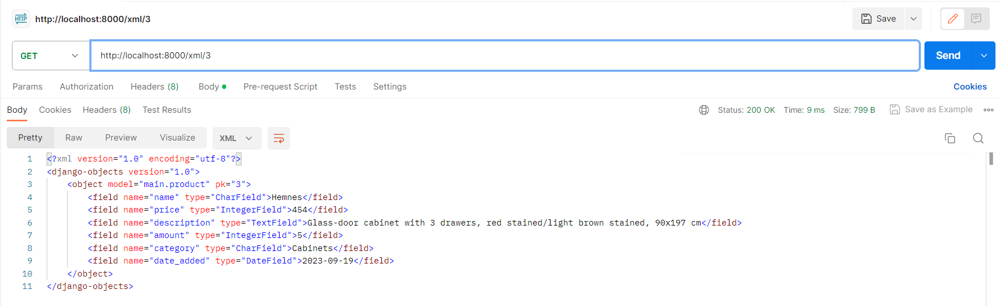

Nama    : Indira Arifia Rahmah

NPM     : 2206811846

Kelas   : PBP B

# Tugas 6

## Perbedaan _Asynchronus_ & _Synchronous Programming_
_Asynchronous_ dan _synchronous programming_ adalah dua gaya pemrograman yang berbeda dalam hal bagaimana mereka menangani _input_ dan _output_ (I/O) dalam program. Secara umum, _asynchronous programming_ memungkinkan program untuk melanjutkan eksekusi tanpa harus menunggu hasil dari operasi I/O, sedangkan _synchronous programming_ mengharuskan program untuk menunggu hasil dari operasi I/O sebelum melanjutkan eksekusi.

Berikut adalah beberapa perbedaan antara _asynchronous_ dan _synchronous programming_:
- **Waktu eksekusi**: _Asynchronous programming_ dapat meningkatkan kinerja program dengan mengurangi waktu tunggu yang disebabkan oleh operasi I/O yang lambat atau berat. Program _asynchronous_ dapat menjalankan beberapa tugas secara bersamaan tanpa harus menunggu tugas lain selesai. Program _synchronous_, sebaliknya, harus menjalankan tugas secara berurutan dan menunggu setiap tugas selesai sebelum memulai tugas berikutnya.
- **Kesulitan**: _Asynchronous programming_ biasanya lebih sulit untuk dipahami dan diimplementasikan daripada _synchronous programming_. Program _asynchronous_ memerlukan penggunaan teknik khusus seperti _callback_, _promise_, _async/await_, atau generator untuk mengelola alur eksekusi program. Program _synchronous_, di sisi lain, lebih mudah untuk diikuti karena alur eksekusi program sesuai dengan urutan kode.
- **Kesalahan**: _Asynchronous programming_ lebih rentan terhadap kesalahan daripada _synchronous programming_. Program _asynchronous_ harus berhati-hati dalam menangani kondisi balapan (_race condition_), _deadlock_, atau _callback hell_ yang dapat menyebabkan program tidak berfungsi dengan baik atau bahkan macet. Program _synchronous_, sebaliknya, lebih mudah untuk ditelusuri dan di-_debug_ karena kesalahan biasanya terjadi pada titik tertentu dalam kode.

## Paradigma dan Contoh _Event-Driven Programming_ Pada Penerapan JS dan AJAX
_Event-driven programming_ adalah paradigma pemrograman yang berfokus pada penanganan _event_ atau kejadian yang terjadi pada program. _Event_ dapat berasal dari interaksi pengguna, _input_/_output_, _timer_, atau sumber lainnya. Program yang menggunakan paradigma ini biasanya memiliki struktur yang fleksibel dan responsif.

Pada JS Kita dapat menggunakan objek DOM untuk mengakses elemen HTML dan menambahkan _event listener_ untuk menentukan fungsi yang akan dijalankan saat _event_ tertentu terjadi. Contoh pada tugas ini, misalnya dalam ...

## Penerapan _Asynchronous Programming_ pada AJAX
 **AJAX** adalah teknik untuk melakukan komunikasi asinkron dengan server web tanpa perlu memuat ulang halaman web. AJAX menggunakan objek `XMLHttpRequest` atau metode `fetch` untuk mengirim dan menerima data dari server. Kita dapat menentukan fungsi _callback_ untuk menangani respon dari server saat _event load_, _error_, atau progress terjadi.
 Contoh: ...

## AJAX dengan Fetch API vs. jQuery
- Sintaks: AJAX dengan Fetch API menggunakan metode _fetch_ yang mengembalikan sebuah _Promise_, yang merupakan objek yang merepresentasikan hasil akhir dari operasi asinkron `Promise` dapat diikuti oleh metode `then` untuk menangani respon sukses, atau metode `catch` untuk menangani respon gagal.
- AJAX dengan jQuery menggunakan metode `$.ajax` yang menerima sebuah objek sebagai parameter, yang berisi berbagai opsi untuk mengatur permintaan, seperti `url`, `method`, `data`, `success`, `error`, dll.
- Kesesuaian: AJAX dengan Fetch API adalah fitur baru yang ditambahkan pada JavaScript versi ES6, sehingga tidak didukung oleh semua browser. Kita dapat menggunakan _polyfill_ untuk membuat Fetch API berfungsi pada browser lama. AJAX dengan jQuery adalah fitur lama yang didukung oleh hampir semua browser, tetapi perlu library jQuery pada halaman web.

- Fitur: AJAX dengan Fetch API memiliki fitur lebih banyak dan fleksibel daripada AJAX dengan jQuery. Beberapa fitur tersebut adalah:
  1. Fetch API dapat melakukan permintaan cross-origin (CORS) tanpa harus mengatur header khusus.
  2. Fetch API dapat melakukan streaming data, yaitu memproses data secara bertahap tanpa harus menunggu seluruh data tersedia.
  3. Fetch API dapat melakukan permintaan `abort`, yaitu membatalkan permintaan yang sedang berlangsung jika diperlukan.

### Cara Saya Mengimplementasikan _Checklist_ Tugas

**End of Tugas 6**

# Tugas 5

## Manfaat dari Setiap Element Selector dan Kapan Waktu yang Tepat untuk Menggunakannya

Element selector, sering disebut juga type selector, adalah cara untuk memilih elemen HTML berdasarkan jenis elemennya. Misalnya:

`p {
    color: red;
}`

Di sini, semua elemen `
` akan berwarna merah.

**Manfaat:**

- Efisiensi: Menggunakan selector ini memungkinkan kita untuk memberikan gaya ke semua elemen dari jenis tertentu tanpa harus menambahkan _class_ atau id spesifik.
- Konsistensi: Membantu menjaga konsistensi tampilan seluruh elemen sejenis di seluruh situs web.

**Waktu yang tepat:**

Menggunakan _element selector_ saat kita ingin memberikan gaya ke semua elemen dari jenis tertentu di seluruh halaman atau situs web.

## HTML5 Tag yang Saya Ketahui
- `<header>`: Representasi container untuk konten pengantar atau set navigasi.
- `<footer>`: Representasi container untuk footer dari sebuah section atau page.
- `<nav>`: Digunakan untuk mendefinisikan bagian navigasi.
- `<article>`: Mewakili konten independen dan mandiri yang dapat dibaca secara terpisah.
- `<section>`: Mewakili bagian dalam dokumen, seperti bab, tab, atau tab.
- `<figure>` dan `<figcaption>`: Mewakili konten seperti ilustrasi, diagram, foto, dan kode.
- `<aside>`: Mewakili konten yang sedikit terkait dengan konten sekitarnya dan dapat dipisahkan tanpa kehilangan arti.
- `
` dan `
`: Mewakili rincian yang pengguna dapat melihat atau menyembunyikan.

## Perbedaan Antara Margin dan Padding

- _Margin_ adalah ruang di luar elemen, di luar batas atau border. Margin tidak memberi warna latar belakang dan digunakan untuk mengatur jarak antara elemen dengan elemen lainnya.
- _Padding_ adalah ruang di dalam elemen, antara konten elemen dan batas atau border elemennya. Padding akan mempengaruhi dimensi elemen kecuali jika _box-sizing_ diatur menjadi `border-box`.

## Perbedaan antara Framework CSS Tailwind dan Bootstrap, serta Kapan Waktu yang Ttepat dalam Menggunakannya

- **Tailwind CSS**: Merupakan sebuah framework CSS _utility-first_ yang memungkinkan kita membangun desain custom dengan cepat. Kita sering membangun desain dengan menambahkan class utility secara langsung ke elemen HTML.
- **Bootstrap**: Merupakan sebuah framework CSS yang menyediakan komponen desain dan gaya yang telah didefinisikan. Sangat cocok untuk prototipe cepat atau saat ingin sebuah UI yang konsisten dengan upaya minimal.

**Kapan menggunakan Bootstrap:**

1. Ketika membutuhkan prototipe yang cepat.
2. Jika tidak memerlukan desain yang sangat custom.
3. Jika ingin memanfaatkan komponen-komponen yang sudah siap pakai.

**Kapan menggunakan Tailwind CSS:**

1. Ketika Kita ingin kontrol penuh atas desain kita.
2. Jika lebih menyukai pendekatan _utility-first_ dalam _styling_.
3. Jika ingin membangun komponen UI yang _custom_.

### Cara Saya Mengimplementasi _Checklist_ Tugas

1. Memahami struktur HTML agar ketika dilengkapi dengan CSS tidak salah.
2. Mengubah laman login, register, dan create_product dengan CSS sederhana.
3. Saya menggunakan Card dalam inventori produk di laman main. Card tersebut saya ambil dari bootstrap dan dikenai perubahan sedikit agar lebih menyesuaikan.
4. Pada tahap ini juga saya telah berhasil mengimplementasikan file static CSS untuk HTML, yang pada tugas-tugas sebelumnya saya menggunakan CSS masih pada laman HTML langsung.

**End of Tugas 5**

# Tugas 4

## Django UserCreationForm

Django UserCreationForm adalah sebuah formulir yang digunakan untuk membuat pengguna baru, dengan tidak ada hak istimewa, dari nama pengguna dan kata sandi yang diberikan. Formulir ini merupakan bagian dari modul `django.contrib.auth`, yang menyediakan sistem autentikasi bawaan Django. Formulir ini hanya memiliki dua bidang: password1 dan password2, yang digunakan untuk memverifikasi bahwa pengguna memasukkan kata sandi yang sama.

**Kelebihan**

1. Formulir ini merupakan bagian dari sistem otentikasi bawaan Django, yang menyediakan fitur-fitur seperti manajemen pengguna, grup, izin, dan sesi;
2. Formulir ini hanya memiliki dua bidang: password1 dan password2, yang digunakan untuk memverifikasi bahwa pengguna memasukkan kata sandi yang sama dan mencegah kesalahan ketik atau lupa kata sandi;
3. Formulir ini juga memiliki metode save, yang mengatur kata sandi pengguna dan menyimpannya ke basis data. Hal ini dapat mempermudah proses pendaftaran pengguna tanpa perlu menulis kode tambahan;
4. Formulir ini dapat disesuaikan dengan menurunkan kelas UserCreationForm dan menambahkan bidang tambahan yang diinginkan.

**Kekurangan**

1. Formulir ini tidak memiliki validasi atau sanitasi untuk bidang *username*, sehingga pengguna dapat memasukkan karakter apa saja yang mungkin menyebabkan masalah. Misalnya, jika pengguna memasukkan username yang sudah ada, formulir akan menampilkan pesan kesalahan yang kurang informatif;
2. Formulir ini tidak memiliki fitur untuk mengirim email konfirmasi atau aktivasi kepada pengguna yang baru mendaftar. Hal ini dapat mengurangi kepercayaan atau keamanan pengguna terhadap aplikasi kita;
3. Formulir ini tidak memiliki fitur untuk mengatur kebijakan kata sandi, seperti panjang minimal, karakter khusus, atau masa berlaku. Hal ini dapat meningkatkan risiko kebocoran atau peretasan kata sandi pengguna.

## Autentikasi vs. Otorisasi dalam konteks Django

### Autentikasi

Otentikasi adalah proses memverifikasi identitas pengguna dengan mendapatkan semacam kredensial dan menggunakan kredensial tersebut untuk memverifikasi identitas pengguna1. Django menyediakan sistem otentikasi bawaan yang dapat digunakan untuk mengelola pengguna, grup, izin, dan sesi. Sistem otentikasi Django memiliki beberapa komponen utama, seperti model User, backend otentikasi, formulir otentikasi, tampilan otentikasi, dan dekorator otentikasi. Sistem otentikasi Django dapat disesuaikan dengan kebutuhan aplikasi, misalnya dengan menggunakan backend otentikasi kustom, model User kustom, atau formulir otentikasi kustom.

### Otorisasi

Otorisasi adalah proses menentukan tingkat akses apa yang harus dimiliki pengguna tertentu (terotentikasi) ke sumber daya yang dikendalikan oleh sistem. Django menyediakan sistem otorisasi bawaan yang dapat digunakan untuk memberikan izin spesifik kepada pengguna atau grup untuk melakukan tindakan tertentu pada objek tertentu. Sistem otorisasi Django memiliki beberapa komponen utama, seperti *model Permission*, *model Group*, *backend* otorisasi, dekorator otorisasi, dan utilitas otorisasi. Sistem otorisasi Django juga dapat disesuaikan dengan kebutuhan aplikasi, misalnya dengan menggunakan *backend* otorisasi kustom, *model Permission* kustom, atau sistem otorisasi berbasis objek.

Kedua sistem ini penting karena mereka membantu menjaga keamanan dan integritas data aplikasi. Dengan menggunakan sistem otentikasi dan otorisasi Django, kita dapat memastikan bahwa hanya pengguna yang sah yang dapat mengakses aplikasi kita, dan hanya memberikan akses yang sesuai dengan peran dan tanggung jawab mereka. Hal ini dapat mencegah penyalahgunaan data, manipulasi data, atau serangan dari pihak yang tidak berwenang.

## *Cookies* dalam Konteks Aplikasi Web, dan Penggunaan *Cookies* dalam Django untuk Mengelola Data Sesi Pengguna

*Cookies* adalah file yang dibuat oleh situs web yang dikunjungi oleh pengguna. Cookies berisi informasi tentang aktivitas dan preferensi pengguna di situs web tersebut. Cookies dapat membantu situs web untuk menyediakan konten yang lebih personal, mengingat informasi *login*, menampilkan iklan yang relevan, dan lain-lain.

Django adalah sebuah *framework web* yang menggunakan *cookies* untuk mengelola data sesi pengguna. Data sesi adalah data yang disimpan di sisi server dan dikaitkan dengan pengunjung situs web tertentu. Data sesi dapat berisi informasi apa saja yang berguna untuk aplikasi, seperti status *login*, keranjang belanja, atau data formulir.

Django menggunakan cookies untuk mengirim dan menerima ID sesi, yaitu sebuah string acak yang unik untuk setiap sesi. ID sesi disimpan dalam *cookie* yang dikirim ke browser pengguna saat sesi pertama kali dibuat. *Cookie* ini kemudian dikirim kembali ke server pada setiap permintaan selanjutnya. Django menggunakan ID sesi untuk mencari data sesi yang sesuai di basis data, *file* sistem, atau *cache*, tergantung pada *backend* sesi yang dipilih.

Django juga memberikan beberapa opsi untuk mengonfigurasi *cookies* sesi, seperti masa berlaku, domain, jalur, aman, *httponly*, dan lain-lain. Django juga mendukung backend sesi berbasis *cookie*, yang menyimpan data sesi secara langsung dalam *cookie*, bukan hanya ID sesi. *Backend* ini lebih cepat dan sederhana, tetapi memiliki beberapa keterbatasan, seperti ukuran *cookie* yang terbatas dan risiko keamanan.

## Apakah penggunaan cookies aman secara default dalam pengembangan web, apakah ada risiko potensial yang harus diwaspadai?

Penggunaan cookies dalam pengembangan web tidak sepenuhnya aman secara *default*, karena ada beberapa risiko potensial yang harus diwaspadai, seperti:

1. **Risiko privasi.** *Cookies* dapat mengumpulkan informasi tentang aktivitas dan preferensi pengguna di situs web, yang dapat digunakan untuk menargetkan iklan, menyesuaikan konten, atau menganalisis perilaku. Informasi ini dapat bersifat sensitif atau pribadi, dan dapat disalahgunakan oleh pihak yang tidak berwenang;
2. **Risiko keamanan.** *Cookies* dapat disusupi oleh pihak yang tidak bertanggung jawab, yang dapat menyebabkan kerusakan pada perangkat pengguna atau mengakibatkan kebocoran informasi yang sensitif. Misalnya, *cookie* dapat dicuri, dipalsukan, atau dimanipulasi oleh penyerang untuk mendapatkan akses ke akun pengguna atau data penting;
3. **Risiko performa.** Jika terlalu banyak *cookie* disimpan di perangkat pengguna, ini dapat menyebabkan penurunan performa komputer atau perangkat mobile pengguna. *Cookie* juga dapat memakan ruang penyimpanan dan *bandwidth*, yang dapat memperlambat proses *loading* situs web.

Untuk mengurangi risiko-risiko tersebut, ada beberapa langkah yang dapat dilakukan oleh pengembang web dan pengguna, seperti:

1. Menggunakan *cookie* sesi daripada *cookie* persisten atau *cookie* pihak ketiga, karena *cookie* sesi lebih aman dan hanya berlaku selama sesi *browser* berlangsung;
2. Menggunakan enkripsi dan validasi untuk melindungi data *cookie* dari pencurian atau modifikasi;
3. Menggunakan fitur kebijakan *cookie* atau undang-undang *cookie* untuk memberi tahu pengguna tentang penggunaan *cookie* di situs web dan meminta persetujuan mereka sebelum menyimpan *cookie* di perangkat mereka;
4. Menghapus *cookie* yang tidak diperlukan atau sudah kadaluarsa dari perangkat pengguna secara berkala.
5. Menggunakan *browser* yang memiliki fitur keamanan dan privasi yang baik, seperti memblokir *cookie* pihak ketiga, menghapus riwayat *browsing*, atau menggunakan mode penyamaran.

## Tambahan: Penerapan Step-By-Step Pengerjaan Tugas

**Mengimplementasikan Fungsi Registrasi, Login, dan Logout**
1. Membuat sebuah *form* registrasi yang berisi input untuk *username*, *email*, *password*, dan konfirmasi *password*;
2. Membuat sebuah *route* untuk menangani permintaan POST dari *form* registrasi;
3. Membuat sebuah *form login* yang berisi *input* untuk *username* atau *email* dan *password*. Kamu juga perlu menambahkan validasi untuk *input* tersebut, sama seperti *form* registrasi;
4. Membuat sebuah *route* untuk menangani permintaan POST dari *form login*. Selain itu, *set session cookie* untuk pengguna yang berhasil *login* menggunakan *library* yang sama dengan *form* registrasi;
5. Membuat sebuah *route* untuk menangani permintaan GET dari tombol *logout*. Di dalam *route* ini, kamu perlu melakukan beberapa hal, seperti:
  - Menghapus *session cookie* untuk pengguna yang sedang login menggunakan library yang sama dengan form registrasi dan login;
  - Mengarahkan pengguna ke halaman utama atau halaman login.

**END OF TUGAS 4**

# Tugas 3
## POST vs. GET
Metode POST dan GET adalah metode _request_ yang paling umum digunakan dalam protokol HTTP untuk berkomunikasi dengan server. Keduanya digunakan untuk mengirimkan data dari klien ke server, namun cara dan tujuannya berbeda.

**GET**
1. Tujuan utama dari metode GET adalah untuk mengambil data dari server;
2. Data yang dikirim ke server ditambahkan atau muncul di URL dalam bentuk _query string_, contohnya: http://ruby.com/page?name=Hemnes&qty=3. Hal ini menyebabkan adanya batasan jumlah karakter yang bisa dimasukkan;
3. Informasi yang dikirimkan menjadi kurang aman karena bisa dilihat langsung pada URL sehingga cocok untuk mengirim data yang kurang sensitif;
4. GET lebih cocok untuk permintaan yang tidak mengubah status data di server, seperti mengambil halaman web atau mengambil data.

**POST**
1. Tujuan utama dari metode POST adalah untuk mengirimkan data ke server untuk diproses;
2. Data yang dikirim ke server masuk ke dalam _body request_ (tidak muncul di URL) sehingga tidak memiliki batas jumlah karakter;
3. Lebih aman sehingga cocok untuk mengirim data sensitif;
4. Cocok untuk mengirimkan data _form_, mengunggah file, atau melakukan operasi yang mengubah data di server.

## Perbedaan Antara JSON, XML, dan HTML dalam Konteks Pengiriman Data
Dilansir dari AWS Amazon, JSON (JavaScript Object Notation) dan XML (eXtensible Markup Language) adalah representasi data yang digunakan dalam pertukaran data antaraplikasi. JSON adalah format pertukaran data terbuka yang dapat dibaca baik oleh manusia maupun mesin. JSON bersifat independen dari setiap bahasa pemrograman dan merupakan _output_ API umum dalam berbagai aplikasi. XML adalah bahasa markah yang menyediakan aturan untuk menentukan data apa pun. XML menggunakan tanda untuk membedakan antara atribut data dan data aktual. Meskipun kedua format tersebut digunakan dalam pertukaran data, JSON lebih fleksibel dan populer digunakan. Sedangkan, HTML (Hypertext Markup Language) adalah bahasa markah yang digunakan untuk membuat halaman web. HTML digunakan untuk mengatur tampilan dan struktur halaman web.

**XML (Extensible Markup Language)**
- Tujuan: XML dirancang untuk menyimpan dan mengangkut data dan bahasa markup yang memungkinkan definisi tag secara kustom;
- Struktur: XML menggunakan tag (mirip dengan HTML) untuk mendefinisikan elemen data dan memiliki struktur yang hierarkis;
- Format: XML menyimpan data dalam struktur pohon dengan _namespace_ untuk kategori data yang berbeda;
- Keterbacaan: strukturnya lebih rumit daripada JSON;
- Metadata: XML memungkinkan penyertaan atribut dalam elemen, memungkinkan penyimpanan metadata tambahan;
- Dukungan: hampir semua bahasa pemrograman memiliki dukungan untuk _parsing_ dan menghasilkan XML.

**JSON (JavaScript Object Notation)**
- Tujuan: JSON adalah format ringan untuk pertukaran data antar klien dan server atau antara aplikasi;
- Struktur: JSON memiliki struktur objek dan array yang lebih sederhana/ringkas daripada XML;
- Format: JSON menggunakan struktur seperti __map__ dengan _key-value pair_;
- Keterbacaan: JSON lebih mudah dibaca dan ditulis oleh manusia dibandingkan dengan XML;
- Metadata: JSON tidak mendukung atribut dalam bentuk yang sama. Semua data, termasuk metadata, dinyatakan dalam pasangan kunci-nilai;
- Dukungan: karena kedekatannya dengan JavaScript, JSON sangat populer dalam aplikasi web modern dan memiliki dukungan luas di berbagai bahasa pemrograman.

**HTML (Hypertext Markup Language)**
- Tujuan: HTML adalah bahasa _markup_ yang digunakan untuk mendeskripsikan halaman web. Tujuan utamanya adalah presentasi konten atau me-_render_ data di browser web, bukan penyimpanan atau transport data;
- Struktur: HTML menggunakan _tag_ untuk mendefinisikan elemen seperti paragraf, tautan, gambar, dll;
- Keterbacaan: HTML dapat dibaca oleh manusia tetapi fokusnya adalah pada presentasi, bukan struktur data;
- Metadata: HTML memiliki atribut untuk banyak elemennya, yang digunakan untuk mendefinisikan karakteristik tambahan (misalnya, atribut `src` untuk tag `img`);
- Dukungan: semua browser web dapat mem-_parse_ dan menampilkan halaman HTML.

## Alasan JSON Sering Digunakan dalam Pertukaran Data Antara Aplikasi Web Modern
- Keterbacaan yang baik. JSON memiliki format yang dapat dibaca oleh manusia. Hal ini memudahkan pengembang memahami isinya tanpa memerlukan alat bantu khusus;
- Ringkas dan performanya baik. Hal ini membuat pertukaran data menggunakan JSON cenderung lebih cepat karena ukurannya yang lebih kecil;
- Tidak memerlukan parsing tambahan saat digunakan dalam aplikasi berbasis JavaScript. Hal ini memudahkan integrasi dengan teknologi web modern seperti Node.js dan berbagai kerangka kerja berbasis JavaScript;
- Strukturnya sederhana, berupa _key-value pair_ dan daftar nilai yang diurutkan. Kedua struktur ini cukup untuk mendefinisikan data dalam banyak aplikasi;
- Standarisasi JSON adalah telah ditentukan dalam RFC 8259 sehingga ada spesifikasi jelas yang diterima secara luas tentang bagaimana harus berfungsi;
- Penggunaan dalam API RESTful. JSON menjadi format _default_ untuk banyak API RESTful. Oleh karena itu, banyak aplikasi yang mengadopsi arsitektur RESTful memilih JSON sebagai format pertukaran data mereka;
- Tidak memerlukan _Namespace_. Berbeda dengan XML, JSON tidak memerlukan _namespace_, yang dapat menyederhanakan dokumen dan mengurangi kerumitan;

**Tampilan objek dalam format HTML, JSON, XML, JSON by ID, dan XML by ID**

Format HTML

Format JSON

Format XML

Format JSON by ID

Format XML by ID

Cara saya mengimplementasikan _checklist_ tugas ini secara _step-by-step_ adalah dengan memperhatikan atau mempelajari dulu pengaruh perintah-perintah (commands), yang diajarkan pada sesi tutorial, terhadap app shopping_list. Kemudian, setelah cukup memahaminya, saya mulai mengerjakan tugas ini. Hal ini membantu saya untuk menghindari perbuatan "hanya _copy-paste_" perintah dalam mengerjakan tugas ini.

**END OF TUGAS 3**

# Tugas 2
Nama Aplikasi: Ruby (tautan adaptable.io: https://my-app-ruby.adaptable.app/)

Pengerjaan tugas ini adalah hasil pembelajaran dari tutorial yang telah diajarkan saat sesi lab di kuliah. Cara saya menuntaskan tugas ini adalah melalui pembuatan proyek lain sebagai latihan terlebih dulu sebelum mengerjakan proyek ini. Dengan demikian, saya memahami langkah demi langkahnya dengan membiasakan diri membuat suatu proyek.

Dalam bagan tersebut, berikut adalah penjelasannya:

1. _Client_ mengirimkan HTTP _Request_ ke _Load Balancer_.
2. _Load Balancer_ meneruskan _request_ tersebut ke Django Web App.
3. Django Web App menggunakan urls.py untuk pemetaan URL dan menentukan _view_ mana yang harus dipanggil.
4. views.py dapat melakukan _query_ ke database melalui models.py.
5. models.py bertugas untuk mengambil data dari Database.
6. views.py juga bertugas untuk me-_render_ template yang ada di HTML Template.
7. Setelah itu, Django Web App mengirimkan HTTP Response kembali ke _Client_.

_Virtual Environment_ adalah alat yang membantu memisahkan dependensi yang diperlukan oleh berbagai proyek dengan membuat lingkungan virtual python terisolasi untuk proyek tersebut.
Jika kita menggunakan virtual environment dalam membuat web aplikasi, beberapa manfaat yang kita dapatkan, yaitu:
1. Dependensi yang terisolasi. Artinya setiap proyek dapat memiliki dependensi yang berbeda dengan versi yang berbeda. Hal ini berfungsi untuk menghindari konflik antar versi.
2. Keamanan. Jika ada suatu pustaka pada proyek kita yang rentan keamanannya maka risiko keamanan hanya dimiliki oleh pustaka itu saja, lingkungan lainnya tidak.
3. Virtual environment memungkinkan kita untuk menggunakan versi Python yang berbeda untuk proyek yang berbeda.
4. Memudahkan dalam berbagi proyek. Requirements.txt memudahkan kolaborasi antarpengembang karena dapat dengan muda mengintall semua dependensi yang diperlukan dalam virtual environment mereka sendiri.

Virtual environment penting dalam membuat proyek seperti web aplikasi ini. Akan tetapi, kita juga dapat membuat aplikasi web berbasis Django tanpa menggunakan virtual environment. Tentu saja hal ini diikuti oleh beberapa risiko, seperti (1) rentan akan konolik antardependensi; (2) Jika ingin memperbarui atau menghapus pustaka tertentu maka harus dengan cara manual; (3) 
Jika ada proyek yang rentan keamanannya, maka akan memengaruhi proyek lainnya juga.

Model-View-Controller (MVC), Model-View-Template (MVT), dan Model-View-ViewModel (MVVM) adalah pola desain yang digunakan dalam pengembangan perangkat lunak, khususnya aplikasi web dan aplikasi berbasis GUI. Berikut ini penjelasan singkat dan perbedaan dari ketiga pola desain tersebut:

**Model-View-Controller (MVC)**

Model: Bagian ini bertanggung jawab atas data dan aturan bisnis. Ini mewakili struktur data dan menyediakan mekanisme untuk membaca, menyimpan, dan memperbarui data.
View: Bagian ini menampilkan data untuk pengguna. Dalam aplikasi web, view biasanya adalah halaman HTML yang dihasilkan.
Controller: Menerima input dari pengguna melalui view, memprosesnya (dengan interaksi dengan model), dan mengembalikan tampilan output yang sesuai.
Aplikasi yang sering menggunakan pola ini: Rails, ASP.NET MVC, dan banyak framework web lainnya.

**Model-View-Template (MVT)**

Mirip dengan MVC, namun dengan sedikit perbedaan dalam pendekatan.
Model: Sama seperti di MVC.
View: Bertanggung jawab untuk memproses model dan mengembalikannya ke template. Dalam konteks Django (yang menggunakan MVT), "view" lebih seperti controller dalam MVC.
Template: Ini adalah bagian yang menggambarkan bagaimana data harus ditampilkan. Ini mirip dengan "view" dalam MVC.
Django adalah contoh framework yang menggunakan pola MVT. Meskipun sering disebut sebagai "MVC", Django sebenarnya lebih mendekati MVT.

**Model-View-ViewModel (MVVM)**

Sering digunakan dalam aplikasi berbasis GUI, seperti yang dibuat dengan WPF, Angular, atau Knockout.js.
Model: Sama seperti di MVC dan MVT.
View: Hanya bertanggung jawab untuk menampilkan UI. Tidak memiliki logika bisnis.
ViewModel: Bertindak sebagai penghubung antara Model dan View. ViewModel menyajikan data dari Model dalam format yang dapat dengan mudah ditampilkan oleh View, dan juga menerima perintah dari View.
MVVM memungkinkan pemisahan yang lebih baik antara logika bisnis dan tampilan UI, memudahkan pengujian, dan mendukung pemrograman reaktif.

**Perbedaan Utama:**

MVC: Pemisahan antara data (Model), tampilan (View), dan logika bisnis (Controller).
MVT: Sebuah varian dari MVC di mana "View" dalam MVT bertindak lebih seperti "Controller" dalam MVC, dan "Template" bertindak seperti "View" dalam MVC.
MVVM: Didesain untuk aplikasi berbasis GUI. ViewModel bertindak sebagai perantara antara Model dan View, memungkinkan pengikatan data dua arah dan pemisahan antara logika UI dan logika bisnis.
Meskipun ada perbedaan dalam struktur dan terminologi, tujuan utama dari semua pola desain ini adalah memisahkan tanggung jawab dalam aplikasi, sehingga memudahkan pemeliharaan, pengembangan, dan pengujian.